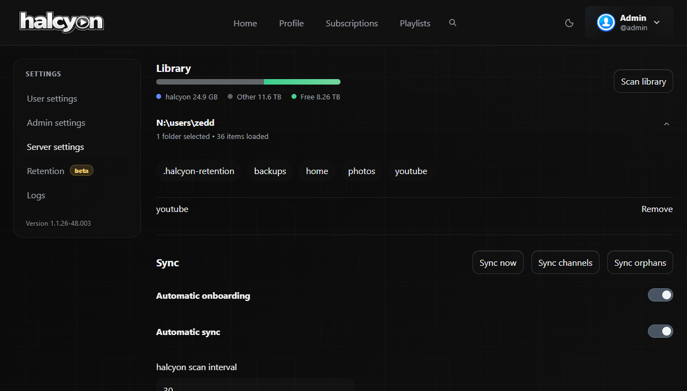
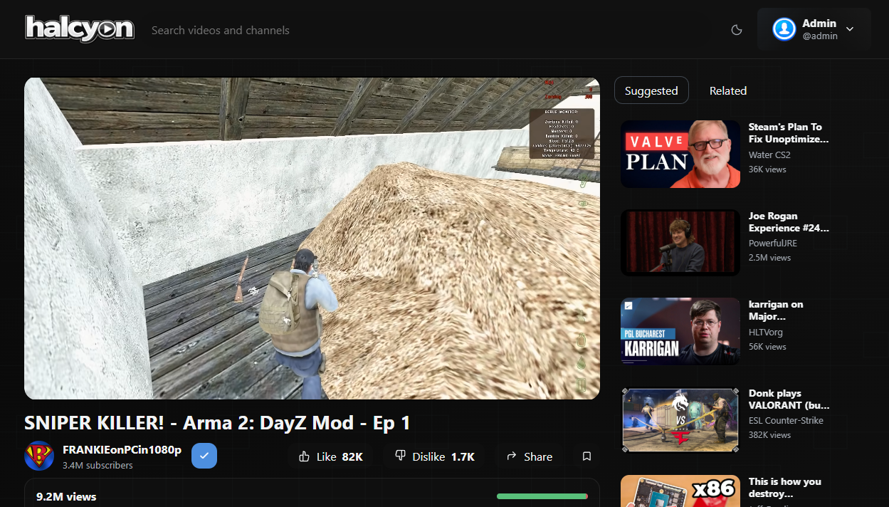
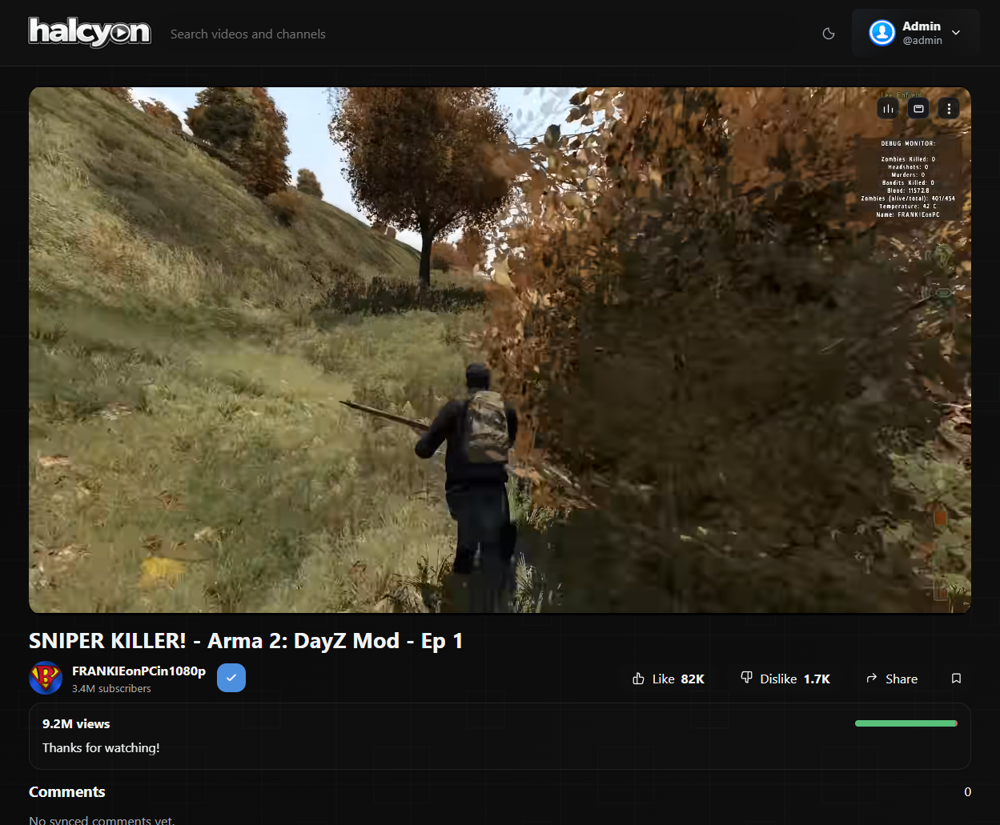

# halcyon

<p align="center">
  
</p>

halcyon is a self-hosted video library for people who miss following creators on purpose.

It is meant to feel closer to the older web: subscriptions first, your own library, your own pace, and a lot less recommendation sludge. The name is deliberate. halcyon is about calm, familiarity, and getting back to media that you actually chose.

If you want the smoothest setup, pair halcyon with [MeTube](https://github.com/alexta69/metube) and point MeTube downloads at the same library folder halcyon scans.

## Screenshots

<details>
  <summary>Browse the interface</summary>
  <br />
  <p>
    
    
  </p>
  <p>
    
    
  </p>
</details>

<details>
  <summary>Watch page</summary>
  <br />
  <p>
    
    
  </p>
</details>

## What it does

- Scans a local video library and gives it a YouTube-style interface
- Supports multiple local users with history, playlists, queues, and saved videos
- Matches local files to YouTube metadata when it can
- Auto-organizes matched videos into per-channel folders
- Generates thumbnails and preview clips
- Handles retention staging, grace periods, revert, and permanent delete
- Falls back to compatibility/transcode playback when needed

## Who it is for

halcyon is for people who want:

- a personal, subscription-first video space
- less algorithmic noise
- more control over their own media
- a familiar interface without the worst parts of modern YouTube

## Stack

- FastAPI
- SQLAlchemy
- PostgreSQL
- React
- TypeScript
- Vite
- ffmpeg / ffprobe
- Docker Compose

## Quick start

The release folder is meant to work on both Windows and Linux with Docker Compose. The compose file uses relative paths and the included helper scripts wrap the common commands.

### 1. Get the project

Clone the repository if you want the simplest update path:

```bash
git clone git@github.com:awpsec/halcyon.git
cd halcyon
```

You can also download a release archive and extract it somewhere permanent.

### 2. Check the local folders

halcyon expects these directories:

- `data/config`
- `data/cache`
- `library`

They are already included in the release package. If you want to use a different media location, change the bind mount in `docker-compose.yml`.

You can also edit the `docker-compose.yml` environment values to fit your setup. For example, you might mount a NAS location like `/mnt/nas/halcyon` into the container as `/library`, or point MeTube and halcyon at the same custom media directory.

If you use MeTube, set its download directory to the same `library` folder. halcyon will see the new file, identify the channel, create the channel folder if needed, and move the matched file into place without needing a second sync.

### 3. Optional: create `.env`

Copy `.env.example` to `.env` only if you want to override defaults.

### 4. Start halcyon

```bash
docker compose up --build -d
```

That starts:

- `postgres`
- `web`
- `worker`

The shipped compose file uses a `60` second background scan interval by default. If you want slower or faster automatic onboarding, edit `HALCYON_SCAN_INTERVAL_SECONDS` in `docker-compose.yml`.

### 5. Optional: install the `halcyon` command

If you want reusable helper commands like `halcyon status` and `halcyon update`, run the bootstrap step once:

Linux/macOS:

```bash
./halcyon status
```

Windows PowerShell:

```powershell
.\halcyon.ps1 status
```

That bootstrap run will try to install the `halcyon` command into a writable location on your `PATH`. If your `PATH` is locked down, you can keep using the local wrapper scripts directly.

### 6. Open it

Open [http://localhost:11111](http://localhost:11111).

## Helper commands

halcyon includes simple helper commands for the common Docker Compose tasks:

- `halcyon start`
- `halcyon stop`
- `halcyon status`
- `halcyon update`

These are optional convenience wrappers around Docker Compose. If you skipped the bootstrap step or your `PATH` is locked down, you can keep using `docker compose ...`, `./halcyon ...`, or `.\halcyon.ps1 ...` directly.

`halcyon update` keeps your `data/` folders, database volume, library mount, and saved settings in place. It pulls the newest version and rebuilds the stack.

## First boot

On a fresh install, halcyon creates:

- `admin`
- `guest` with password `guest`

The bootstrap `admin` password is printed in the container logs.

To find it:

```bash
docker compose logs web
```

Then:

1. Sign in as `admin`
2. Save the recovery phrase somewhere safe
3. Confirm that you saved it
4. Set the permanent admin password

Keep the recovery phrase. If you ever lose the admin password, that phrase is what the recovery flow depends on.

halcyon writes rotating application logs to `./data/config/halcyon.log`. `docker compose logs` should stay focused on useful service status, while the file log keeps the fuller application history.

## Recommended after setup

1. Open `Settings`
2. Confirm the library location is correct
3. Add a YouTube API key in Admin settings if you want richer sync data
4. Review retention settings before enabling them
5. Create any other local accounts you want
6. Only promote trusted accounts to admin

When a newer version is available, Admin settings shows an update indicator beside the version footer and gives you the current version, newest version, and the command to run on the host.

## Library behavior

The intended flow is simple:

1. MeTube drops a file into the same library folder halcyon watches
2. halcyon detects it
3. halcyon syncs and identifies the channel
4. halcyon creates the channel folder if needed
5. halcyon moves the matched file there and keeps the metadata intact

If something is already matched but sitting in the wrong place, regular sync can repair that too.

## Retention

Retention uses a staging folder and a grace period:

1. older items are marked
2. marked items move to the retention folder
3. each item gets its own delete timer
4. items can be reverted during that window
5. once the timer expires, they can be deleted permanently

Reverting puts the file back where it came from, including its original subfolder path.

## Development

### Backend

```bash
cd backend
pip install -e .[dev]
uvicorn app.main:app --reload
```

### Frontend

```bash
cd frontend
npm install
npm run dev
```

## Default ports

- App: `11111`
- Postgres is internal to Docker and is not exposed on the host by default.

## Version

Current release package:

- `1.1.26-411.004`

## Credits

- [MeTube](https://github.com/alexta69/metube), recommended for feeding downloads into the library
- [Return YouTube Dislike](https://www.returnyoutubedislike.com/), for the public API and the dislike/vote data used during sync enrichment
